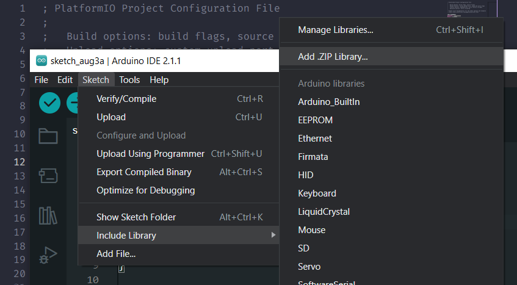

# Library for JRC Board Smart Home kit

## Installation

### PlatformIO

Add the github link of this repository to the lib_deps and Save the file.

```
lib_deps=
    https://github.com/JRCBoard/JRC-Board-Smart-Home
```

### Arduino

- Download the library from the github repository as .zip file.
- Install the library from arduino IDE:
  - Select Sketch > Include Library > Add .Zip Library
    
  - Find the downloaded zip file and click Open to complete the install.
